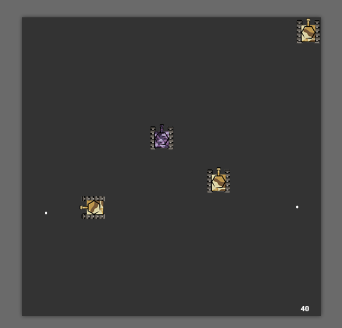

# javascript tanks #

Simple game implementation with easeljs (top library for work with canvas). It was created for small experience and for one university course.

For tank navigation use arrows.
For tank fire use space.

Features:
---
- You control a tank;
- For every 50 points your enemies becomes faster and their rockets too;
- For every 100 points you become faster and your rockets too;
- Enemies can run over you;
- Enemies can intersect each other. It's normal. Friendly fire doesn't works for them;
- Your goal is to get as more points as possible.

Of course I can add sounds, explosion animations, borders etc.

Created by:
--- 
Anton Golovin (code), Julia Soboleva (sprites for tanks).